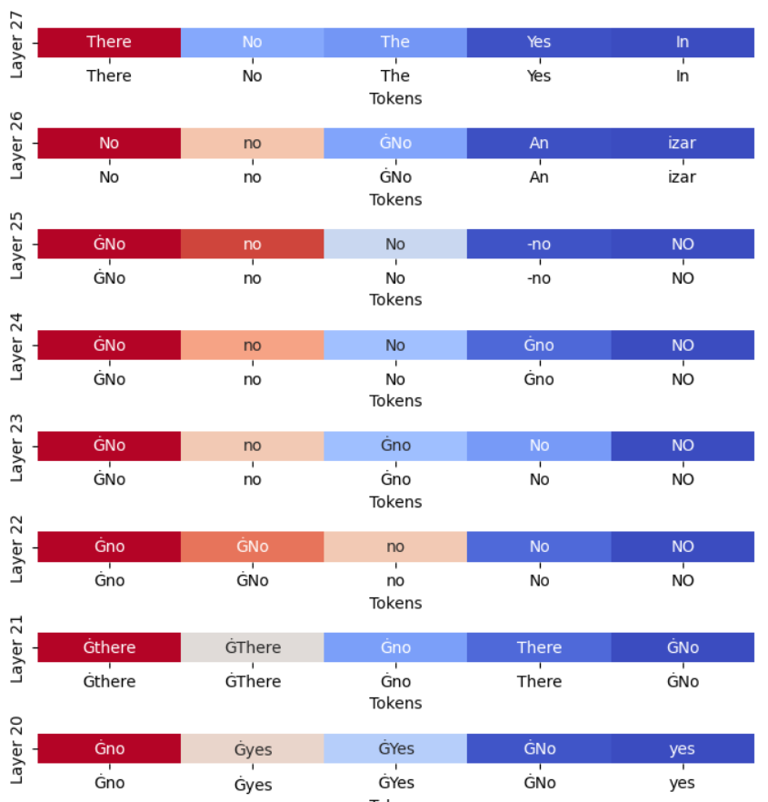

# tlab-test

## Реализация Logit Lens
В ноутбуке tlab-test реализованы все необходимые функции для визуализации метода Logit Lens.

Также в ноутбуке есть подробное описание этого метода и анализ статей, ниже продублированы ключевые точки, найденные в ходе работы.

## Logit Lens: описание подхода

Разберем его на примере классических генеративных языковых моделей. У них к выходному слою применяется функция активации, чтобы преобразовать выходы в вероятности. 

**Logit Lens** - это метод, основанный на том, что мы пробуем применить эту же функцию активации к более ранним слоям, чтобы иметь возможность как-то интерпретировать работу модели. 

Работу нейросетей обычно достаточно сложно интерпретировать. В контексте трансформеров - обычно изучают то, на что направлено внимание сетки (то есть изучают слои attention). 

Отличие Logit Lens (будем называть LL) от классического подхода: традиционный метод фокусируется на том, как модель обновляет свою "веру" на каждом шаге, а LL делает акцент именно на том, во что модель верит. 

Важно помнить, что результаты LL - это лишь частичная интерпретация

### Этапы "уверенности" модели

Поймем, что нам дает LL. На самом деле, в глубокой сети уверенность в ответе обычно появляется задолго до последнего слоя, просто модель уточняет некоторые детали. В целом, модель проходит шаги от полной неуверенности в ответе до сначала некоторых догадок, а потом уже уверенных предположений. Разумеется, в каких-то случаях некоторые из этих этапов не встречаются. 

### Интересные выводы про LL

В исследованиях заметили, что начальные слои хранят что-то вроде "бессмыслицы" (тотальная неуверенность). В том смысле, что входные данные мгновенно преобразуются в сложное представление, которое, однако, понятно для модели, и постепенно преобразуется в ответ. То есть сетка ни в каком виде не пытается хотя бы примерно хранить input-ы, она мгновенно их изменяет. 

## Итоги моих экспериментов
В целом, можно сделать такие выводы:
* ответ модели начинает зарождаться в среднем на 18-20 слоях
* зачастую слои 24-26 совпадают, но последний слой обычно очень резко меняет распределение - в угоду грамматике
* модель может обнаруживать правильный ответ на более ранних слоях (21-22), но далее начинает сомневаться и менять ответы

Пример визуализации:

## Плюсы и минусы метода LL

Плюсы:
* показывает, в какой момент модель начинает формировать ответ
* прост в реализации, понятен

Минусы:
* в действительности не всегда факт, что колебания модели - это плохо (пример: вдруг модель размышляет "от противного")
* плохо позволяет понимать причины неверных ответов, которым модель дает высокую вероятность еще с ранних этапов

Про последнее - есть статья про "галлюцинации" модели, про которую я напишу ниже

## Обзор литературы

Я выбрал такие статьи:

1) https://aclanthology.org/2024.emnlp-main.387.pdf
2) https://arxiv.org/html/2411.19187v1
3) как продолжение предыдущей: https://arxiv.org/html/2411.19187v1#S5

**Первая статья** выступает за поддержку и использование этого подхода. Авторы брали модели LLAVA-NeXT и InstructBLIP Они изучают домен-специфические нейроны (отвечающие за какие-то конкретные домены). Этих нейронов менее 1% от общего числа, но их отключение снижает accuracy на 10%. Но обычно модели их используют не очень активно. 

Таким образом, авторы используют LL как инструмент для проверки своих гипотез, но анализируют на более детальном уровне (не просто по слоям). 

Вероятно, такой подход было бы интересно применить для qwen2-vl, потому что тогда можно будет получить более подробный анализ работы модели. 

**Вторая статья** рассматривает галлюцинации моделей - когда модель уверрено выдает неверный ответ. Испольховался датасет HQH. У LL здесь обнаруживаются существенные ограничения

Авторы нашли у LL такие минусы:
* LL проверяет только соответствие токенов, но не учитывает контекст (как раз таки тот случай, о котором я писал - вдруг модель рассуждает "от противного")
* метод малоэффективен в задачах OCR, поиском атрибутов объектов и пространственным отношениями/сравнением

Был предложен подход на основе контекстных эмбеддингов промежуточных слоев модели. Такой подход позволяет точнее детектировать галлюцинации и привязывать ответы модели к визуальным объектам. А еще он обеспечивает точную привязку ответов модели к объектам на изображении с помощью ограничивающих рамок и тем самым  упрощает задачу "атрибуции". 

Такая фича является, наверно, наиболее существенным улучшением Logit Lens, которое можно попробовать применить к qwen2-vl
